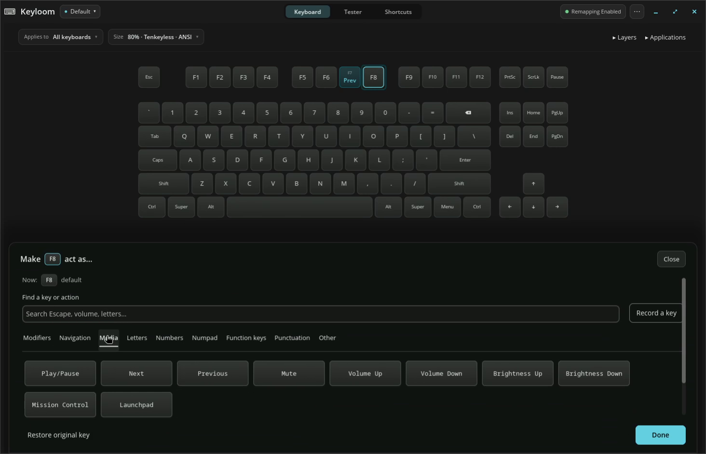
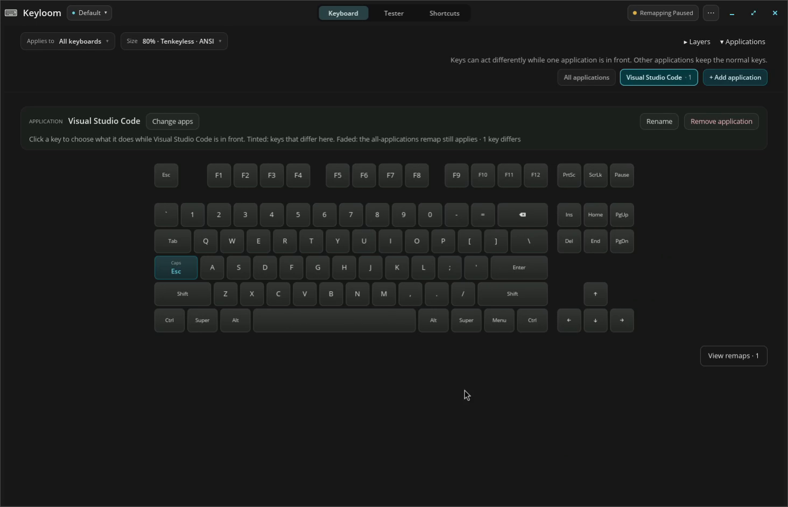
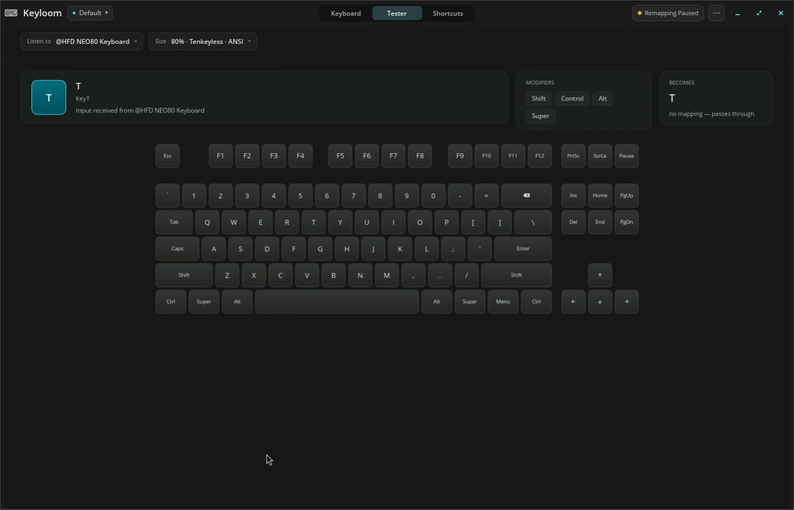

# Keyloom

**Your keyboard, the way you want it.**

Keyloom is a visual keyboard customization app for Linux. Click a key,
choose what it should do, and it takes effect right away. Simple things
stay simple, with real power when you want it.

**[Download Keyloom →](https://github.com/BlakeGardner/Keyloom/releases)**

## Remap keys visually

Pick a key and give it a new job. Here F7, F8, and F9 become media
controls like Previous, Play/Pause, and Next.

▶ **[Watch the demo](docs/media/basic-remaps.mp4)** · 30 seconds

## Remap keys in one application

A key can behave differently in one application and stay normal
everywhere else. Here Caps Lock becomes Escape in Visual Studio Code.

▶ **[Watch the demo](docs/media/application-remaps.mp4)** · 24 seconds

## Test your keyboard

See keys light up as you press them, and what each one sends. Keyloom
works out your keyboard's size and layout for you.

▶ **[Watch the demo](docs/media/keyboard-tester.mp4)** · 26 seconds

## More in Keyloom

- **Tap and hold**: Escape when tapped, Control when held.
- **Layers**: hold Caps Lock and H/J/K/L become arrow keys, while every
  other key keeps working normally.
- **Shortcuts**: turn one chord into another, so Super+C sends the
  terminal's Ctrl+Shift+C.
- **Profiles**: keep separate setups for work, gaming, or Mac-style
  controls and switch as your day changes.
- **One keyboard at a time**: customize your laptop and external keyboards
  independently.
- **Unusual keys too**: media, brightness, and Apple's Mission Control and
  Launchpad keys.
- **Changes apply themselves**: no Apply button, and one click pauses
  remapping when you want your original keys back.
- **At home on your desktop**: a native app for Wayland and X11 that
  follows your light/dark theme, and your accent color on COSMIC.

## Get Keyloom

Visit the **[releases page](https://github.com/BlakeGardner/Keyloom/releases)**
for downloads and release notes.

Keyloom is in early development. It does its remapping through
[xremap](https://github.com/xremap/xremap): a guided first-run setup
downloads it if it isn't installed, then takes care of the background
service and input permissions.

## What's next

See the [upcoming features roadmap](docs/Upcoming_Features.md) for plans
beyond the first release, including more keyboard layouts, a translated
interface, and a log viewer.

## License

Keyloom is free and open source, licensed under [GPL-3.0-only](LICENSE).
