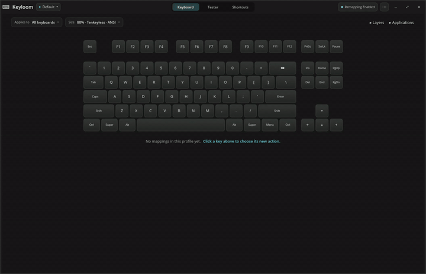
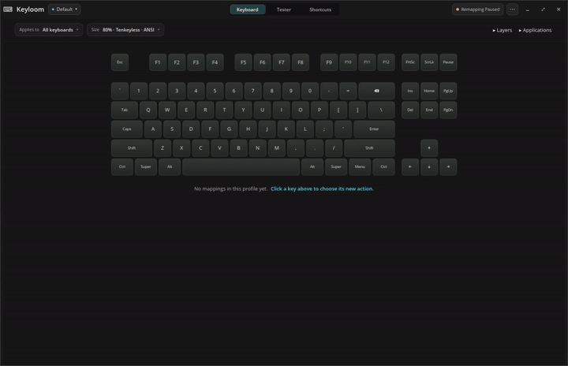
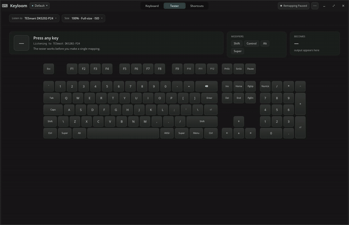

<p align="center">
  
</p>

<h1 align="center">Keyloom</h1>

<p align="center"><strong>Your keyboard, the way you want it.</strong></p>

<p align="center">
  Keyloom is a visual keyboard customization app for Linux. Click a key,
  choose what it should do, and it takes effect right away.
</p>

<p align="center"><a href="https://keyloom.net"><strong>keyloom.net</strong></a> · <a href="#install-keyloom"><strong>Install Keyloom →</strong></a></p>

<p align="center">
  
</p>

## Different keys in different apps

A key can do one thing in one application and stay normal everywhere
else. Here Caps Lock becomes Escape in Visual Studio Code.

<p align="center">
  
</p>

## Test your keyboard

Keys light up as you press them, and you see what each one sends.
Keyloom works out your keyboard's size and layout for you.

<p align="center">
  
</p>

## And more

- **Tap and hold**: Escape when tapped, Control when held.
- **Layers**: hold Caps Lock and H/J/K/L become arrow keys, while every
  other key keeps working normally.
- **Shortcuts**: turn one chord into another, so Super+C sends the
  terminal's Ctrl+Shift+C.
- **Profiles**: separate setups for work, gaming, or Mac-style controls,
  and one click pauses remapping when you want your original keys back.
- **Per-keyboard setups**: customize your laptop and external keyboards
  independently.
- **Unusual keys too**: media, brightness, and Apple's Mission Control and
  Launchpad keys.

## Install Keyloom

Add the repository for your distribution once, and Keyloom updates with
the rest of your system.

### Debian

<details>
<summary><b>Debian 13</b></summary>

```sh
echo 'deb http://download.opensuse.org/repositories/home:/BlakeGardner:/Keyloom/Debian_13/ /' | sudo tee /etc/apt/sources.list.d/home:BlakeGardner:Keyloom.list
curl -fsSL https://download.opensuse.org/repositories/home:BlakeGardner:Keyloom/Debian_13/Release.key | gpg --dearmor | sudo tee /etc/apt/trusted.gpg.d/home_BlakeGardner_Keyloom.gpg > /dev/null
sudo apt update
sudo apt install keyloom
```

</details>

<details>
<summary><b>Debian testing</b></summary>

```sh
echo 'deb http://download.opensuse.org/repositories/home:/BlakeGardner:/Keyloom/Debian_Testing/ /' | sudo tee /etc/apt/sources.list.d/home:BlakeGardner:Keyloom.list
curl -fsSL https://download.opensuse.org/repositories/home:BlakeGardner:Keyloom/Debian_Testing/Release.key | gpg --dearmor | sudo tee /etc/apt/trusted.gpg.d/home_BlakeGardner_Keyloom.gpg > /dev/null
sudo apt update
sudo apt install keyloom
```

</details>

### Ubuntu / Pop!_OS

<details>
<summary><b>Ubuntu 24.04 or Pop!_OS 24.04</b></summary>

```sh
echo 'deb http://download.opensuse.org/repositories/home:/BlakeGardner:/Keyloom/xUbuntu_24.04/ /' | sudo tee /etc/apt/sources.list.d/home:BlakeGardner:Keyloom.list
curl -fsSL https://download.opensuse.org/repositories/home:BlakeGardner:Keyloom/xUbuntu_24.04/Release.key | gpg --dearmor | sudo tee /etc/apt/trusted.gpg.d/home_BlakeGardner_Keyloom.gpg > /dev/null
sudo apt update
sudo apt install keyloom
```

</details>

<details>
<summary><b>Ubuntu 25.10</b></summary>

```sh
echo 'deb http://download.opensuse.org/repositories/home:/BlakeGardner:/Keyloom/xUbuntu_25.10/ /' | sudo tee /etc/apt/sources.list.d/home:BlakeGardner:Keyloom.list
curl -fsSL https://download.opensuse.org/repositories/home:BlakeGardner:Keyloom/xUbuntu_25.10/Release.key | gpg --dearmor | sudo tee /etc/apt/trusted.gpg.d/home_BlakeGardner_Keyloom.gpg > /dev/null
sudo apt update
sudo apt install keyloom
```

</details>

<details>
<summary><b>Ubuntu 26.04</b></summary>

```sh
echo 'deb http://download.opensuse.org/repositories/home:/BlakeGardner:/Keyloom/xUbuntu_26.04/ /' | sudo tee /etc/apt/sources.list.d/home:BlakeGardner:Keyloom.list
curl -fsSL https://download.opensuse.org/repositories/home:BlakeGardner:Keyloom/xUbuntu_26.04/Release.key | gpg --dearmor | sudo tee /etc/apt/trusted.gpg.d/home_BlakeGardner_Keyloom.gpg > /dev/null
sudo apt update
sudo apt install keyloom
```

</details>

### Fedora

<details>
<summary><b>Fedora 43</b></summary>

```sh
sudo dnf config-manager addrepo --from-repofile=https://download.opensuse.org/repositories/home:BlakeGardner:Keyloom/Fedora_43/home:BlakeGardner:Keyloom.repo
sudo dnf install keyloom
```

</details>

<details>
<summary><b>Fedora 44</b></summary>

```sh
sudo dnf config-manager addrepo --from-repofile=https://download.opensuse.org/repositories/home:BlakeGardner:Keyloom/Fedora_44/home:BlakeGardner:Keyloom.repo
sudo dnf install keyloom
```

</details>

<details>
<summary><b>Fedora Rawhide</b></summary>

```sh
sudo dnf config-manager addrepo --from-repofile=https://download.opensuse.org/repositories/home:BlakeGardner:Keyloom/Fedora_Rawhide/home:BlakeGardner:Keyloom.repo
sudo dnf install keyloom
```

</details>

### Arch-based distributions (Omarchy, CachyOS, Manjaro)

<details>
<summary><b>Arch Linux and derivatives</b></summary>

Keyloom is not on the AUR yet. Until it is, every
[release](https://github.com/BlakeGardner/Keyloom/releases) carries an
Arch package for x86_64; download the `.pkg.tar.zst` and install it:

```sh
sudo pacman -U ~/Downloads/keyloom-*-x86_64_arch.pkg.tar.zst
```

Updates are not automatic: fetch the new file when a release comes out.

Prefer to build from source, or on ARM? The PKGBUILD lives in this
repository. In an empty directory, with `base-devel` installed:

```sh
curl -O https://raw.githubusercontent.com/BlakeGardner/Keyloom/main/packaging/arch/PKGBUILD
makepkg -si
```

This builds the latest release from source, which takes a few minutes.

</details>

Prefer a one-off download? Every
[release](https://github.com/BlakeGardner/Keyloom/releases) has a `.deb`
and an `.rpm` for 64-bit Intel/AMD and ARM, and an Arch package for
64-bit Intel/AMD.

---

<p align="center">
  Free and open source under <a href="LICENSE">GPL-3.0</a>
  · Built on <a href="https://github.com/xremap/xremap">xremap</a>
  · <a href="docs/Upcoming_Features.md">Roadmap</a>
</p>
