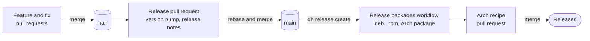

# Release process

How Keyloom goes from merged work to a published release. Work lands on
`main` through pull requests; when it is time for a release, one more
pull request bumps the version and carries the release notes, and
publishing a GitHub release from the merged result tags it and starts
the packaging pipeline described in
[packaging/README.md](../packaging/README.md).



Agents prepare a release up to the release pull request: the branch,
any preparation commits, the version bump, validation, and the release
notes. The maintainer merges it, publishes the GitHub release, and
merges the Arch recipe pull request; an agent publishes a release or
pushes a tag only when asked to.

## Between releases

Features and fixes land on `main` through their own pull requests, each
with the product documentation it changes (see [AGENTS.md](../AGENTS.md)),
and are squash-merged as usual. None of them touches the version in
`Cargo.toml`: only a release pull request moves it.

## 1. Choose the version

Keyloom is before 1.0, so the minor number marks features:

- **0.x.0** when the release brings a user-facing feature someone would
  notice, such as a new window, view, or kind of keyboard: 0.2.0 (Apple
  keyboards, keyboard zoom), 0.3.0 (the remapping log).
- **0.x.y** for fixes, dependency updates, and refinements of existing
  features: 0.1.1 to 0.1.3, 0.2.1.

Commits that only plan work ("Plan …") or change documentation do not
count. `git log --oneline vPREVIOUS..origin/main` lists what the release
would carry.

## 2. Prepare the release branch

```sh
git fetch origin
git switch -c release-X.Y.Z origin/main
```

Before bumping the version, check three things:

- **xremap digests.** `RELEASES` in `src/install.rs` must keep the
  digests of every xremap version a tagged Keyloom downloaded; dropping
  one leaves that copy unrecognised, and setup never offers its users
  the update. Add the previous release to `DOWNLOADED_BY` in the
  `releases_earlier_keylooms_downloaded_stay_recognised` test, even when
  the xremap pin did not move (0.3.0 added `("0.2.1", "0.15.14")`).
- **The release workflow.** `git diff vPREVIOUS origin/main --
  .github/workflows/release.yml` shows what changed in it, Dependabot's
  action updates included. It runs only for releases, so nothing has
  exercised those changes yet; read the breaking changes of any action
  that moved a major version.
- **Packaging.** `git diff --stat vPREVIOUS origin/main -- packaging
  scripts` shows whether the distributions built changed, which the
  release notes' Install paragraph must follow.

Fixes found while preparing go in their own commits, before the release
commit.

## 3. Bump the version

Set `version = "X.Y.Z"` in `Cargo.toml`, then move the lock file:

```sh
cargo update --workspace --offline
```

Commit `Cargo.toml` and `Cargo.lock`, and nothing else, as
"Release X.Y.Z", after running the validation commands in
[AGENTS.md](../AGENTS.md).

## 4. Write the release notes

The Debian and RPM changelogs are fixed text that links to the GitHub
release, so the release notes are the only description of a release.
Follow the earlier ones (`gh release view v0.3.0`):

- The title is "Keyloom X.Y.Z".
- One opening sentence says what the release brings.
- `## Changes` has one bullet per change a user would notice, each with
  a bold lead-in: what changed, where to find it, and its known limits
  ("Not yet: …"). Internal refactors, CI, and tests are left out; a
  dependency update gets a bullet only for what users notice.
- `## Install` repeats the previous release's paragraph, with the
  distribution list updated if packaging changed.
- The notes end with `**Full changelog:**
  [vPREVIOUS...vX.Y.Z](https://github.com/BlakeGardner/Keyloom/compare/vPREVIOUS...vX.Y.Z)`.

Keep them in a file for `gh release create`.

## 5. Open the release pull request

Push the branch and open a pull request titled "Release X.Y.Z" whose
description includes the release notes in a collapsed `<details>`
block, so they are reviewed along with the bump. Merge it with
**Rebase and merge**: the default squash merge would fold the
preparation commits into the release commit.

## 6. Publish the release

Once it is merged, publish the release from the merged commit:

```sh
git switch main && git pull --ff-only
git log --oneline -1
gh release create vX.Y.Z --target "$(git rev-parse HEAD)" --title "Keyloom X.Y.Z" --notes-file notes.md
```

`git log` should show "Release X.Y.Z". Publishing creates the tag and
starts the **Release packages** workflow. Leave the release unmarked as
a pre-release unless that is the intent: OBS builds only full releases.

## 7. Let the packages land

The workflow attaches the source bundle within minutes, the Arch package
within the hour, and the `.deb` and `.rpm` files as OBS finishes, which
can take hours. OBS's build root for a rolling distribution (Debian
Testing and Unstable, Fedora Rawhide) breaks now and then; that fails
the run after the other packages are attached, and
`gh workflow run "Release packages" -f tag=vX.Y.Z` retries once OBS has
recovered.

## 8. Merge the Arch recipe pull request

After building and installing the Arch package, the workflow opens
"Update Arch package recipe for X.Y.Z", which points
`packaging/arch/PKGBUILD` at the new tag with the checksum it built
from. The checksum is of the tag's own tarball, so it cannot be part of
the release commit. Merge it to finish the release: until then, people
who build from source as the README describes get the previous release.
CI does not run on pull requests the workflow opens.
