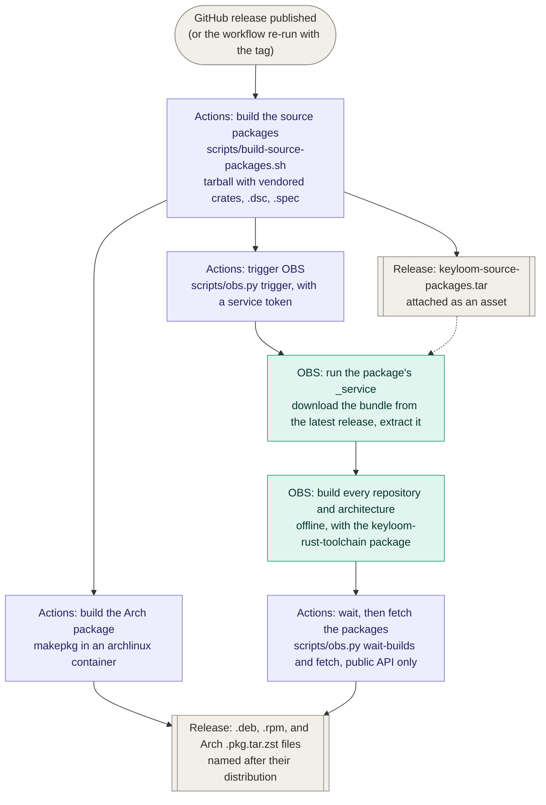

# Packaging

Keyloom's Debian, Ubuntu, and Fedora packages are built on the
[Open Build Service](https://build.opensuse.org/) (OBS). Publishing a GitHub
release starts the pipeline; nothing is built on GitHub's runners except
the source packages and the Arch package, which the workflow builds
itself with makepkg in an Arch container (see [Arch Linux](#arch-linux)).



OBS never receives an account credential: the only secret GitHub holds is
a service token that can do nothing but run one package's source services,
and everything the workflow reads from OBS comes from its public API.

Users install from the OBS repository for their distribution (OBS publishes
an apt repository for each Debian and Ubuntu release and a dnf repository
for each Fedora release under
`https://download.opensuse.org/repositories/<project>/`) or download a
`.deb`, `.rpm`, or Arch `.pkg.tar.zst` from the GitHub release.

## One source tarball, two recipes, one Rust toolchain

libcosmic and its dependencies need Rust 1.93 or newer. Debian 13 ships
1.85, Ubuntu 24.04 backports stop at 1.91, and a Fedora release repository
carries whatever Rust was current when that release shipped; OBS builds
have no network access, so the build service cannot use `rustup`. The
`keyloom-rust-toolchain` package (`packaging/rust-toolchain`) wraps
upstream's `rustc`, `rust-std`, and `cargo` release tarballs for x86_64 and
aarch64, verified against the checksums published on static.rust-lang.org,
and installs them under `/usr/lib/keyloom-rust-toolchain`. Every Keyloom
build uses it, on every distribution, so the packages are built the same
way everywhere. Its source packages live on the GitHub pre-release tagged
`rust-toolchain`, a fixed address the OBS package fetches from. Change
`packaging/rust-toolchain/version` to move to a newer Rust; pushing that
change to `main` replaces the bundle and re-triggers OBS
(`.github/workflows/rust-toolchain.yml`).

The Keyloom source tarball carries the crates it depends on under
`vendor/`, filtered to Linux targets, so OBS can build offline. Both
recipes build from that one tarball: `packaging/debian` for Debian and
Ubuntu, and `packaging/rpm` for Fedora. `scripts/build-source-packages.sh`
adds the generated `debian/changelog` and fills the version and changelog
into `keyloom.spec`; the toolchain package is assembled the same way from
`packaging/rust-toolchain/debian` and `packaging/rust-toolchain/rpm`. An
OBS package holds the `.dsc` and the `.spec` side by side and builds each
repository with the recipe of its format.

## What the workflows expect

The OBS side is configured once by hand and is not part of the repository:
a project whose repositories match `packaging/obs/project.xml`, holding
the packages `keyloom` and `keyloom-rust-toolchain`, each with the
matching `packaging/obs/*._service` file uploaded as `_service`. The
workflows find it through the repository variable `OBS_PROJECT` and
authenticate with the secrets `OBS_TOKEN_KEYLOOM` and
`OBS_TOKEN_TOOLCHAIN`: one OBS service token per package, each able only
to run that package's services. To add or drop a distribution, change
the project's repositories on OBS and in `packaging/obs/project.xml`,
which mirrors them; nothing else needs to change for a Debian- or
RPM-based distribution OBS offers.

The **Rust toolchain package** workflow publishes the toolchain sources
on the `rust-toolchain` pre-release and waits for OBS to build them for
every repository. It runs whenever `packaging/rust-toolchain` changes on
`main` and can be run by hand from the **Actions** tab; the first Keyloom
build in a repository waits for this package to be built there.

## Publishing a release

Bump `version` in `Cargo.toml`, commit, and publish a GitHub release whose
tag is `v` followed by that version, for example `v0.1.0`. The **Release
packages** workflow fails with a clear message on a tag of any other
shape, and on one that does not match `Cargo.toml`.

The workflow attaches `keyloom-source-packages.tar` to the release,
triggers the OBS package, waits for OBS to finish every build (up to five
hours), and attaches the `.deb` and `.rpm` files to the release, named
like `keyloom_0.1.0-1_amd64_ubuntu-24.04.deb` and
`keyloom-0.1.0-7.1.x86_64_fedora-43.rpm` (OBS numbers an RPM's release
itself, without a distribution tag, hence the suffix). A distribution
whose build failed is reported and fails the run, but only after the
packages of the others are attached: OBS's base system for a rolling
distribution such as Debian Unstable or Fedora Rawhide breaks now and
then through no fault of the package, and that should not withhold the
rest. Build logs live on OBS:
`https://build.opensuse.org/package/show/<project>/keyloom`.

To retry an existing release, run the workflow by hand with the tag as
input (`gh workflow run "Release packages" -f tag=v0.1.0`). The sources
always come from the tag, while the recipes and scripts come from the
branch the workflow runs on, so a re-run picks up packaging fixes made
since the release.

OBS fetches the bundle from GitHub's *latest* release, so two things
follow. A release marked as a pre-release (a version such as
`0.2.0-rc.1`) is skipped by the OBS steps and exists only on GitHub. And
re-running the workflow for an older release than the latest one fails at
the "wait for OBS to take the sources" step, because OBS fetched the
latest release instead.

## Building locally

Both sets of source packages can be built on a developer machine without
touching OBS; the scripts need `dpkg-dev`, and the Keyloom one also
`cargo-vendor-filterer` (`cargo install --locked cargo-vendor-filterer`):

```sh
scripts/build-rust-toolchain-source.sh /tmp/keyloom-packages
scripts/build-source-packages.sh /tmp/keyloom-packages
```

To build the Debian binary packages the way OBS does, unpack each `.dsc`
with `dpkg-source -x` in a clean chroot or container of the target
release, install its build dependencies (`apt-get build-dep ./`), and run
`dpkg-buildpackage -us -uc -b`. Build and install `keyloom-rust-toolchain`
first; the `keyloom` package depends on it.

To build the RPM packages the way OBS does, use a clean container of the
target Fedora release with `rpm-build` and `dnf5-plugins` installed, and
from the directory holding the source packages run, again toolchain
first:

```sh
dnf builddep keyloom-rust-toolchain.spec
rpmbuild --define "_sourcedir $PWD" --define "_topdir $PWD/rpmbuild" -bb keyloom-rust-toolchain.spec
dnf install rpmbuild/RPMS/*/keyloom-rust-toolchain-*.rpm
dnf builddep keyloom.spec
rpmbuild --define "_sourcedir $PWD" --define "_topdir $PWD/rpmbuild" -bb keyloom.spec
```

## Arch Linux

`packaging/arch/PKGBUILD` builds a *release* from source the way an AUR
package would: it downloads the tag's tarball from GitHub and
`cargo fetch --locked` resolves the crates its `Cargo.lock` pins,
including libcosmic's git revision. Arch's own `rust` package is always
current, so the keyloom-rust-toolchain package plays no part. The AUR is
where the recipe should end up once new-account registration reopens
there (see [Technical_Backlog.md](../docs/Technical_Backlog.md)); until
then the release workflow stands in for it.

The workflow's `arch` job builds the package on the GitHub runner, in an
`archlinux:latest` container, and attaches it to the release as
`keyloom-<version>-<rel>-x86_64_arch.pkg.tar.zst` for a one-off
`pacman -U` install. It uses the PKGBUILD from the commit it runs on
with `pkgver` and `sha256sums` rewritten for the tag being released, so
a release never waits for the committed file to be bumped, and a re-run
picks up recipe fixes. Like the OBS builds, pre-releases are skipped.
The package is x86_64 only (the runner's architecture; Arch Linux itself
supports no other) and unsigned, like the other files on the release.

The committed `pkgver` and `sha256sums` still serve everyone who builds
by hand from the README's instructions. After each release, update
`pkgver`, reset `pkgrel` to 1, and refresh `sha256sums` with the new tag
tarball's checksum, then rebuild once in a clean container the way a
user would:

```sh
docker run --rm -v "$PWD/packaging/arch:/src:ro" archlinux:latest bash -euxc '
    pacman -Syu --noconfirm --needed base-devel rust libxkbcommon desktop-file-utils
    useradd -m builder
    install -d -o builder /build
    install -o builder -m644 /src/PKGBUILD /build/PKGBUILD
    cd /build && sudo -u builder makepkg --noconfirm
    pacman -U --noconfirm keyloom-*.pkg.tar.zst'
```

## Not covered yet

- RPM packages are built for Fedora only; openSUSE and other RPM
  distributions, Flatpak, and other formats are not set up.
- The Arch package is a one-off download: no pacman repository delivers
  updates, the PKGBUILD is not on the AUR yet, and aarch64 users build
  from source.
- Packages are unsigned beyond OBS's own repository signing.
- Pre-releases get no OBS builds (see above).
- No AppStream metadata is installed, so software centers show no
  description or screenshots.
- Packages do not ship xremap; first-run setup downloads it (see
  [Upcoming Features](../docs/Upcoming_Features.md)).
